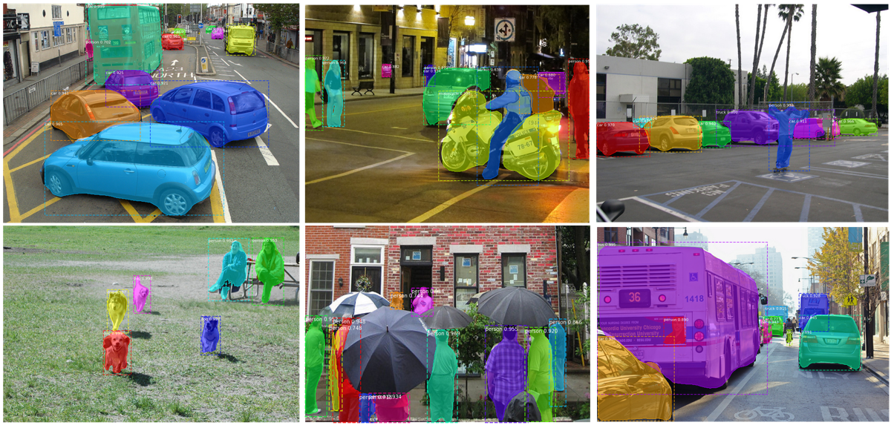
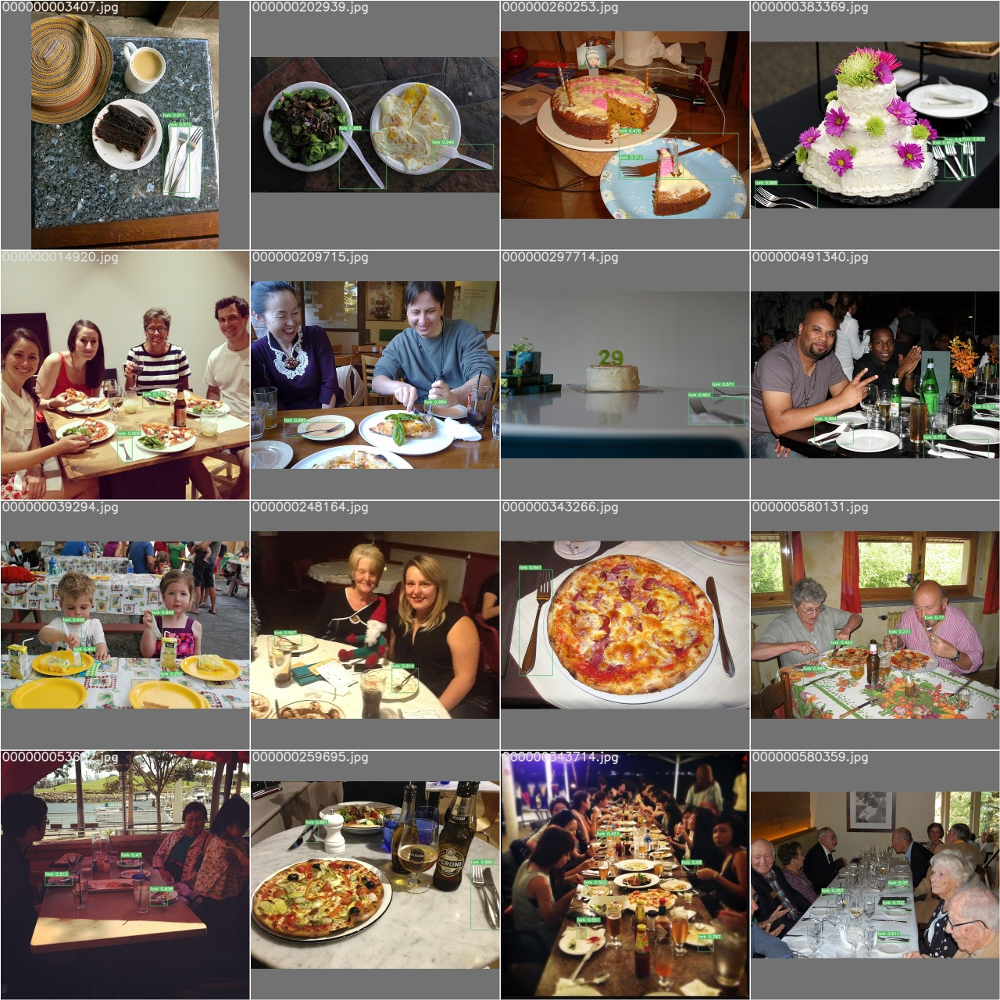
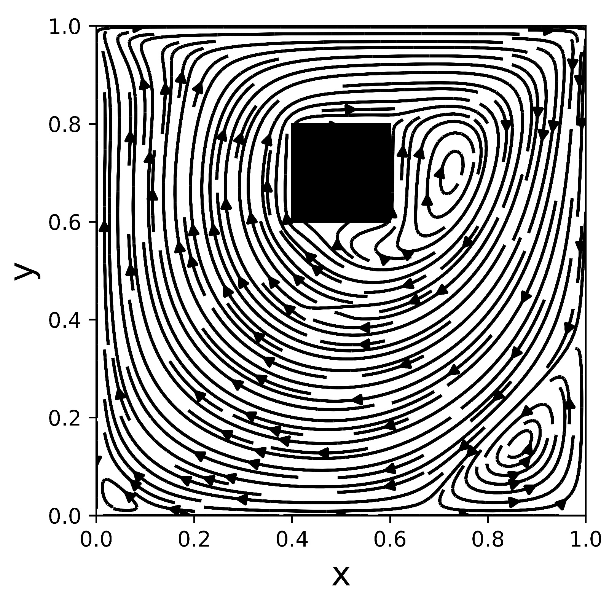
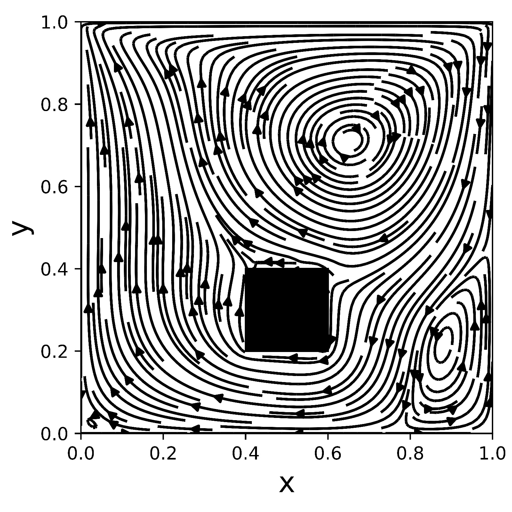
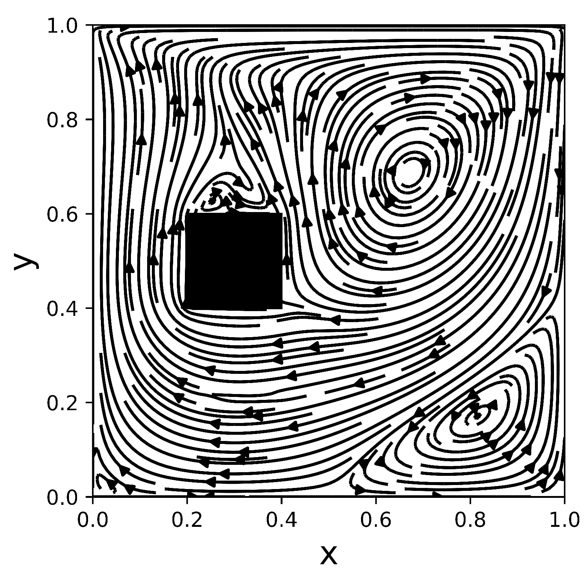
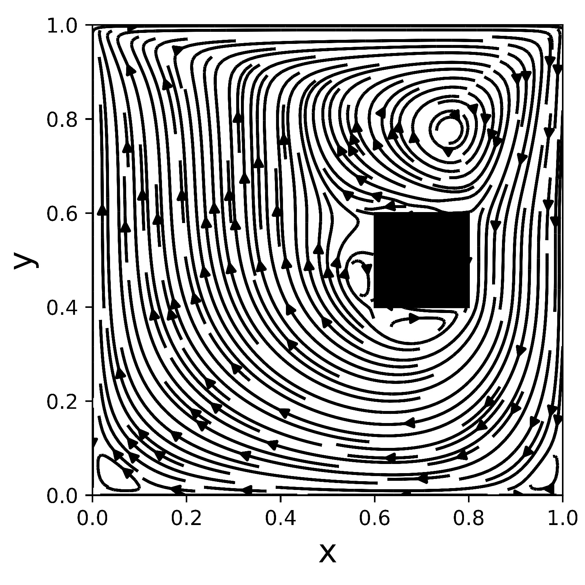

# Hi there, I'm Matheus Teixeira  

    

## Languages and frameworks

    
    
    
    
    
          

    
    
    
        
    
    
    
    
    
    
    
    
    

    
    
    
    
    
    
    
    
    
    
    
    

## Projects

### Stereo vision

Tridimensional information recovery with [stereo vision](https://github.com/mtsousa/PVC-2021-1_Computer-Vision/tree/main/Stereo_vision)

### Object detection and segmentation

[Object detection and segmentation](https://github.com/mtsousa/PVC-2021-1_Computer-Vision/tree/main/Image_segmentation) with Mask-RCNN

### Real-time fork detection

[Fork detection](https://github.com/mtsousa/LARA-2022_Fork-Detection) with YOLOv7

### Numerical simulation

Newtonian fluid in a [lid-drive cavity](https://github.com/mtsousa/MNT-2021-1_Lid-Driven_Cavity) with internal obstacles

|         **40x60, L = 20**      |         **40x20, L = 20**      |
|:------------------------------:|:------------------------------:|
|  |  |
|         **20x40, L = 20**      |         **60x40, L = 20**      |
|  |  |
